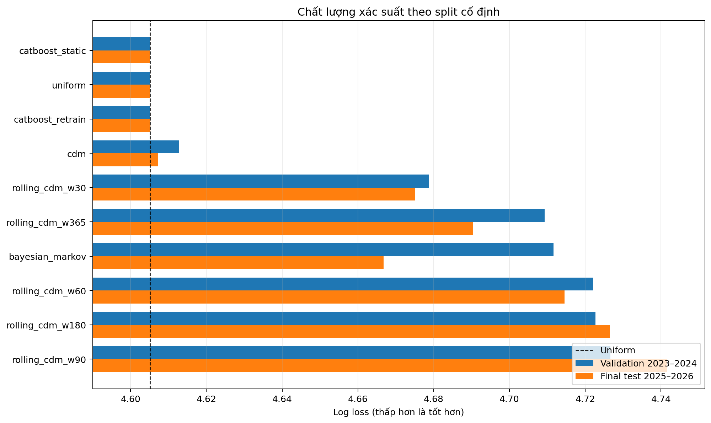
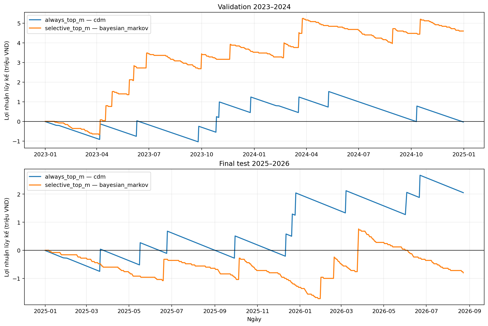

# Báo cáo cuối — KQXS theo split cố định

## 1. Protocol

- Train/development: **2002–2022** — 7.561 kỳ.
- Validation/strategy selection: **2023–2024** — 723 kỳ.
- Final test khóa: **2025–2026** — 595 kỳ, đến ngày 23/08/2026.
- Mọi prediction được tạo từ history trước ngày dự đoán; model state chỉ cập nhật sau khi nhận kết quả ngày đó.
- Cấu hình chiến lược được commit trước khi chạy final test. Primary strategy đã khóa: **selective_top_m**.

## 2. Chất lượng xác suất

| model | log_loss_validation | log_loss_final | gain_validation_vs_uniform | gain_final_vs_uniform |
| --- | --- | --- | --- | --- |
| catboost_static | +4.605101 | +4.605170 | +0.000069 | -0.000000 |
| uniform | +4.605170 | +4.605170 | -0.000000 | -0.000000 |
| catboost_retrain | +4.605172 | +4.605241 | -0.000002 | -0.000071 |
| cdm | +4.612806 | +4.607213 | -0.007636 | -0.002043 |
| rolling_cdm_w30 | +4.678794 | +4.675095 | -0.073624 | -0.069924 |
| rolling_cdm_w365 | +4.709318 | +4.690393 | -0.104148 | -0.085222 |
| bayesian_markov | +4.711658 | +4.666767 | -0.106488 | -0.061597 |
| rolling_cdm_w60 | +4.722037 | +4.714537 | -0.116867 | -0.109367 |
| rolling_cdm_w180 | +4.722691 | +4.726423 | -0.117521 | -0.121253 |
| rolling_cdm_w90 | +4.726592 | +4.741591 | -0.121422 | -0.136420 |

Model đứng đầu validation theo log loss là **catboost_static**. Model đứng đầu final test là **catboost_static**. Chênh lệch so với Uniform rất nhỏ; không có bằng chứng về cải thiện xác suất mạnh và ổn định.

## 3. Chiến lược được khóa trên validation

Quy tắc chọn: tối đa hóa `Wilson lower 95% − hit rate hòa vốn`, tối thiểu 50 lượt cược; tie-break theo tổng lợi nhuận, `m` nhỏ hơn và tên model. Đã xét 1.250 cấu hình từ 10 model.

| strategy | model | m | validation ROI | final bets | final hits | final profit | final ROI | p vs hòa vốn |
| --- | --- | --- | --- | --- | --- | --- | --- | --- |
| always_top_m | cdm | 1 | -0.41% | 595 | 10 | 2,050,000 VND | +34.45% | 0.2154 |
| selective_top_m | bayesian_markov | 4 | +79.31% | 140 | 6 | -800,000 VND | -14.29% | 0.7059 |

## 4. Kết quả final test

- **Always Top‑1 CDM:** 10/595 ngày trúng, lợi nhuận 2,050,000 VND, ROI +34.45%. Tuy nhiên Wilson lower (0.9154%) vẫn thấp hơn mức hòa vốn (1.2500%), nên kết quả dương chưa phải bằng chứng thống kê chắc chắn.
- **Selective Top‑4 Bayesian Markov:** 6/140 lượt trúng, lợi nhuận -800,000 VND, ROI -14.29%. Lợi thế validation không tái lập trên final test.
- CatBoost static trong final bị blend về Uniform theo quyết định từ validation 2023–2024. Periodic retrain cũng không cải thiện log loss final so với Uniform.

## 5. Kết luận

Kết quả refactor xác nhận rằng lợi nhuận quan sát trên validation có thể không tái lập. Always Top‑1 CDM có lợi nhuận dương trong 595 kỳ final, nhưng khoảng tin cậy vẫn chưa vượt hòa vốn. Selective Bayesian Markov — cấu hình tốt nhất trên validation — chuyển sang ROI âm trong final.

Vì vậy, **chưa có bằng chứng đủ mạnh về predictive/economic edge ổn định**. Kết quả Always Top‑1 nên được coi là một quan sát cần thêm dữ liệu tương lai, không phải bằng chứng để khẳng định chiến lược sinh lời bền vững.
